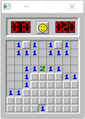
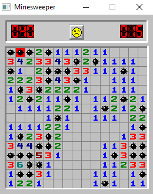

# Minesweeper
Minesweeper written in C using SDL 1.2

- [x] Save, load function
- [x] Customizable
- [x] Time limit

## Prerequisites

- [SDL 1.2](https://www.libsdl.org/download-1.2.php)
- [SDL_image 1.2](https://www.libsdl.org/projects/SDL_image/release-1.2.html)
- [SDL_gfx](http://www.ferzkopp.net/wordpress/2016/01/02/sdl_gfx-sdl2_gfx/)
- [cmake](https://cmake.org/)

## Building from source

Windows

Visual Studio 2017 is needed

```powershell
mkdir build && cd build
cmake ..
minesweeper.sln
```

Linux/Unix

```bash
sudo apt-get install build-essential libsdl1.2-dev libsdl-gfx1.2-dev libsdl-image1.2-dev
mkdir build && cd build
cmake ..
```

The output directory is /bin

## Usage

`minesweeper [Row number] [Column number] [Mine count] [Time limit]`

Save with **F1**
Load with in menu or in game with **F2**

## Preview


